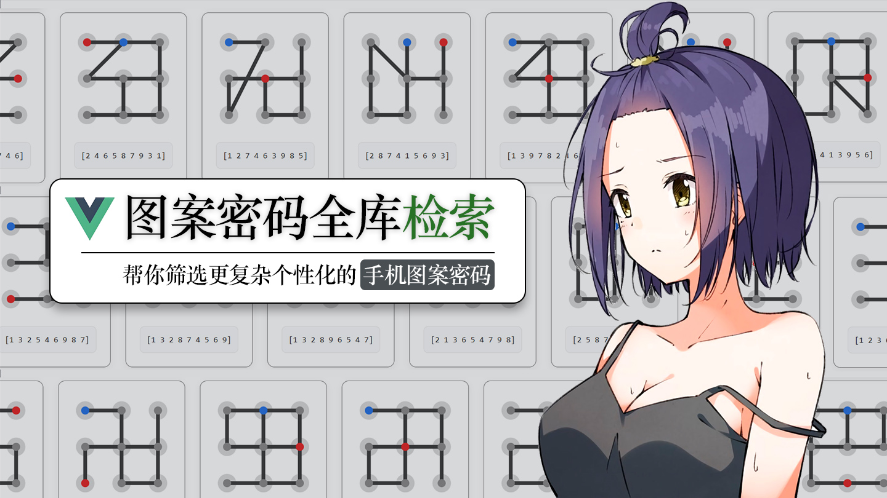

# 还在用‘Z’字图案密码？这个网站能帮你找到更复杂个性化的手机图案密码

`2026.01 | ming`

------

  

图案密码，是我们日常生活中非常熟悉的一种验证方式。无论是手机锁屏、应用加密，还是隐私相册、银行类软件的二次验证，它都以直观、易操作的特点被广泛使用。虽然从安全性角度来说，它可能不如复杂字符密码，但图案密码在记忆门槛和操作趣味性上，有着非常独特的优势。

最近在给新手机设置图案密码的时候，我想了很久要用什么图案当密码，怎样的图案才能既美观别致，又具备足够的迷惑性，让他人难以轻易看透？于是就有了研究图案密码的想法。

通常所说的图案密码，指的是在一个 3×3 的点阵上，依次连接 4 到 9 个不重复的点所形成的路径。现在大部分软件的图案密码至少需要使用到4个点，并且每个点不能重复连接。那么我们就可以把这9个点看成数字小键盘，如下图所示：
$$
\begin{bmatrix}
  1&2  &3 \\
  4&5  &6 \\
  7&8  &9
\end{bmatrix}
$$
这样一来，每一个图案密码都能对应一串由 1~9 中不重复数字所组成的序列。比如经典的“Z”字形图案，对应的密码序列就是 `[1, 2, 3, 5, 7, 8, 9]`。因此，图案密码问题就转化为了数字序列的生成与筛选问题。

既然每个点只能使用一次，且密码长度范围为 4~9，那么总的图案数量就是从 9 个点中选取 $n$ 个点（$n$ 从 4 到 9），并对它们进行全排列的总和。用数学公式表达就是：
$$
\sum_{n=4}^{9} A_{9}^{n} = 985824
$$
也就是说，一共有 **985,824** 种可能的图案。这个数字听起来很大，但对于现代计算机而言，完全在可遍历处理的范围内——我们完全可以通过编写筛选算法，快速找出符合特定样式或规则的图案。

如果你觉得 98 万仍然是个令人望而却步的数字，甚至担心遍历会耗时过长，那或许低估了现代计算机的运算能力。当然，我们还可以通过“去冗余”进一步简化问题。仔细观察下面这组图案：

你会发现，这 8 个图案其实源自同一个“基础图形”，只不过分别经过了 90°、180°、270° 旋转，以及水平翻转、垂直翻转、沿主对角线翻转、沿副对角线翻转等对称变换。在视觉和结构上，它们属于同一类密码模式。因此，如果我们只保留每组对称图案中的“基础版本”，就可以将图案总数量减少至原来的 1/8：
$$
\frac{985824}{8} = 123228
$$
这样一来，我们只需在 **12.3 万** 个有效图案中进行筛选和检索，效率大大提升，也更便于用户聚焦于真正独特的密码设计。

有了想法，就开始着手设计筛选程序了，我一开始打算使用React框架开发一个Web网页的，但是由于有几年没碰React了，我的React还是5年前学的，当初学习的版本与如今的最新语法差异巨大，一时间感到无从下手。并且我也不愿再花时间重新学习它，于是就干脆决定转向 Vue3，好在有过去的前后端开发基础，学习起来并不算吃力。

更重要的是，如今有了 AI 的加持。回想五年前刚入门前后端时，无论是学习新技术还是动手开发，整个过程都相当漫长，每个新知识都要依赖文档、教程或是反复试错，过程漫长且充满不确定性。而现在，AI 极大地加速了这一进程——遇到问题随时提问，AI 给出的解答往往比许多教学视频更直接、更有针对性。在开发过程中，它的辅助更是让效率大幅提升：想要什么组件，什么布局，什么样式，直接向AI描述清楚即可。就拿这个图案密码筛选网站来说，从动手编码到基本完成，前后只用了两天时间。我的大部分精力都放在了系统架构的设计、用户交互的逻辑、筛选规则的制定、图案的绘制方式，以及如何将各个模块有机整合……这些真正需要思考的问题上。

在 AI 时代，我认为程序员的核心价值，越来越体现在对系统架构的把握与全局设计的视野上。很多人为了省事，倾向于让 AI 智能体直接生成整个应用或大型模块；在我看来，这并不是 AI 的最佳使用方式。没有扎实的技术基础，仅凭 AI 生成的项目无异于空中楼阁，难以稳固、更难以迭代。但当你对一个项目的整体流程有了清晰概念和想法，AI 就能成为你得力的助手，是你在主导AI，而不是AI在领导你。这正是“懂技术”和“不懂技术”的人在使用 AI 时的关键差异，你的技术基础，决定着你的AI生成能力的上界。工具越是强大，人的思维和视野就越显珍贵。

回到正题，你可以直接访问这个网址【https://narrastory.rth1.xyz/】在线体验这个工具。(推荐使用125%页面缩放)

接下来，我将详细介绍这个工具中提供的几个筛选条件，帮助你更精准地找到心仪的图案密码。

**1. 节点数量**

节点数量指的是图案密码中连接的点数，范围在 **4 到 9 个** 之间。点数越多，图案越复杂，可能的组合也越多。

**2. 模式选择**

在手机图案密码的设置中，通常有两种连接模式：

- **限制模式**：也是大部分手机的默认模式。当你想连接的两个点之间存在未被使用过的中间点时，系统会自动将该中间点纳入路径。
  例如：连接 `1→3` 会自动变成 `1→2→3`；连接 `1→9` 会自动经过 `5`，变成 `1→5→9`。
  这种模式虽然方便，但也限制了一些特殊“跳点”图案的生成。
- **非限制模式**：关闭限制后，你可以自由连接任意两个点，中间即使有未使用的点也不会被自动加入。
  例如：可以直接连接 `1→3`，系统不会添加点 `2`。

**3. 跳点设置**

“跳点”是指在连接路径中，跳过某个中间点直接连接更远的点。例如在序列 `[2,1,3]` 中，从 `1` 连接到 `3` 就跳过了 `2`；在 `[3,2,1,9]` 中，从 `1` 到 `9` 跳过了 `5`。

跳点数量反映了一个图案的“非常规”程度。一般来说，跳点越多的图案看起来越不规则，迷惑性也更强，有助于提高密码的防窥视能力。

**4. 线长排序**

“线长”是指构成整个图案的线段总长度。我们可以依次计算相邻两点间的欧几里得距离并累加得到总长。例如下图所示：

上面这个图案的线长就可以这么计算
$$
线长 = \sqrt{5} + \sqrt{2} + 1 + 2 \approx  6.65
$$
你可以选择“按照总线长降序排列”，让最长的图案排在前列。

**5. 线条样式设置**

图案密码中的线段可分为三种基本类型：

1. **直线**：水平或垂直方向（如 `1→2`、`4→7`）
2. **45° 斜线**：斜率为 ±1（如 `1→5`、`3→7`）
3. **1:2斜线**：斜率为 ±2 或 ±1/2（如 `1→6`、`2→7`）

你可以分别设置筛选每种线型的数量，从而控制图案的“几何风格”。比如，只包含 45° 斜线的图案会呈现出整齐的对角线美感；而混合多种线型则会让图案更富有变化。

这个工具不仅是一个密码生成器，也是一次关于排列组合、几何连接与交互设计的轻量实践。如果你对实现细节感兴趣，或希望在本地方便地修改和尝试，项目的完整代码已经开源在：

**GitHub：https://github.com/narrastory/graphic-cryptographic**

需要提醒的是，**图案密码在安全性上存在固有弱点**。图案密码虽然有趣易记，但如果让他人看到你的图案，即使别人未直接看清连接顺序，但仅凭图案形状，也可能在短时间内推测出可能的连接路径。因此，它更适合用于对安全性要求不高的场景，或作为辅助记忆的趣味选择。

感谢阅读，祝你探索愉快！ 🔐✨
